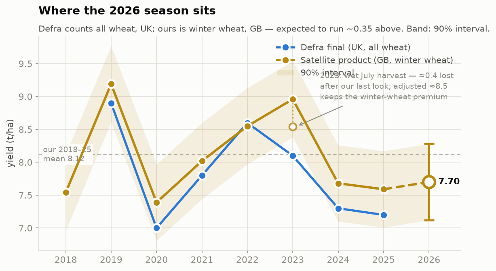
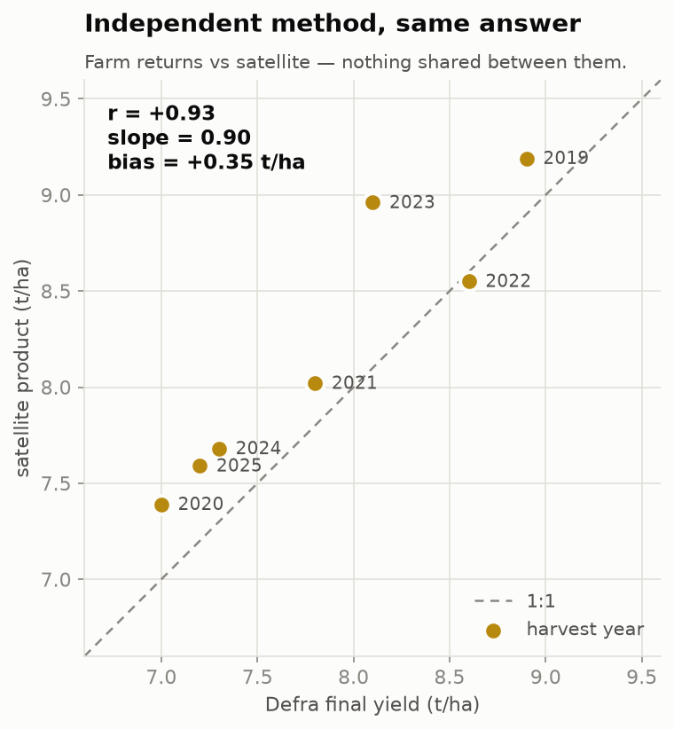
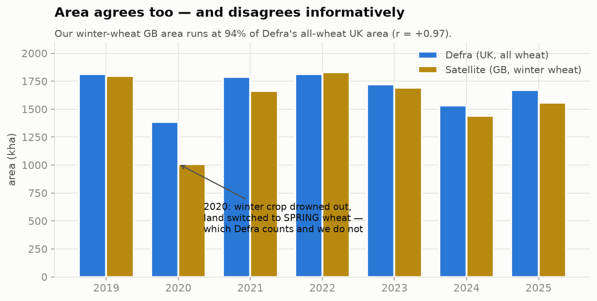
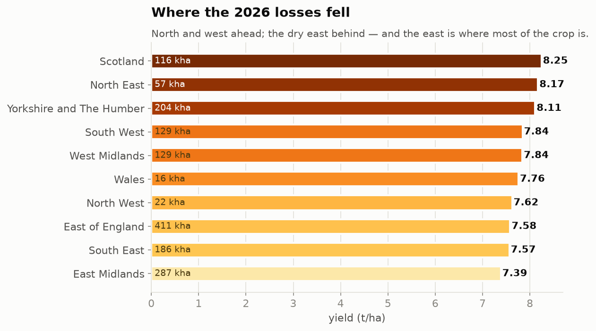
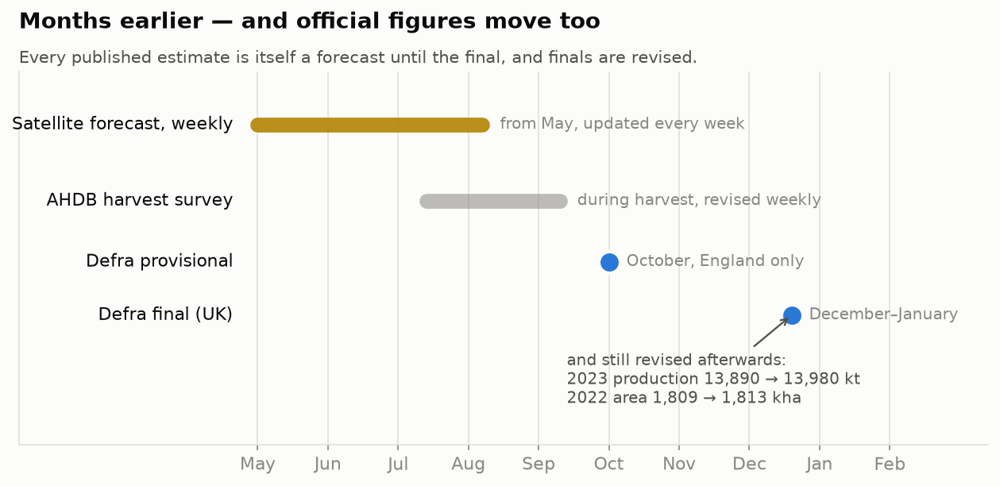
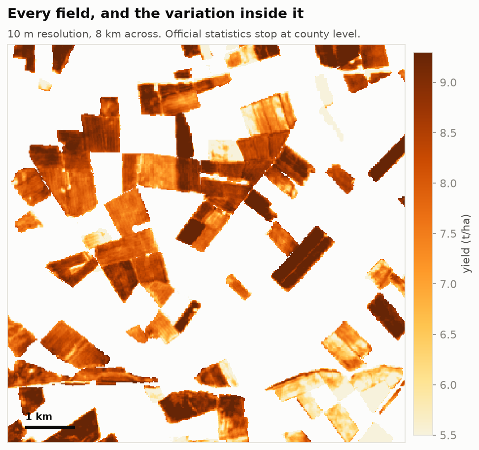

# UK Winter Wheat 2026 — In-Season Satellite Forecast

**Report date:** 19 August 2026 · **Forecast basis:** week of 17 August 2026, model cutoff DOY 213 (1 August)

Produced by UCL and the National Centre for Earth Observation (NCEO), with the UK Centre
for Ecology & Hydrology (UKCEH), as part of the AgZero+ project.

---

## Headline

| | 2026 forecast |
|---|---|
| Mapped winter-wheat area, Great Britain | **1.558 M ha** |
| Area-weighted mean yield | **7.70 t/ha** |
| Production | **12.00 Mt** |
| Crop value at £204.00/t | **2.45 bn £** (90% band 2.10–2.79) |
| Fields mapped | **200,161** |

The July-rain correction is fitted against Defra finals, so it absorbs the
winter-wheat-versus-all-wheat basis (about 0.35 t/ha in a normal year) together with
harvest-period losses: the corrected **7.75 t/ha** (the labelled fitted route; the product headline is the raw 7.70 since 20 Aug) is already on the Defra-comparable
basis — subtracting the basis again would double-count it. That reads as a third
consecutive below-average year (2019–25 Defra mean 7.84), though above 2024 (7.3)
and 2025 (7.2), and materially below the 2019 and 2023 highs.

---

## 1 · Where the season sits

Nine seasons on a consistent area-weighted basis. 2026 is drawn as an open marker because
it is an in-season forecast to 1 August, not a settled year.

Our 2018–25 mean is 8.12 t/ha. The 2026 forecast of 7.70 sits **−5.1%** against it.

---

## 2 · An independent source that agrees

Nothing is shared between the two methods. Defra's figures come from farm returns; ours
come from Sentinel-2 reflectance and a model trained on prior-year county yields. Across
the seven years where Defra finals are verifiable:

| | |
|---|---|
| correlation | **r = +0.93** |
| regression slope | **0.90** — the swing is tracked almost one-for-one |
| mean bias | **+0.35 t/ha** |

The bias is **expected, not error**: Defra reports *all wheat, UK*; we report *winter wheat,
GB*, and winter wheat outyields spring wheat.

---

## 3 · Area agrees — and disagrees informatively

Area correlates at **r = +0.97**, with our winter-wheat GB figure running at 94% of Defra's
all-wheat UK figure.

**2020 is the exception that proves the method.** Our area falls to 73% of Defra's, because
the flooded autumn of 2019 pushed growers off winter wheat and onto *spring* wheat — which
Defra counts and we, by design, do not. The product detected a national cropping switch.

---

## 4 · Where the 2026 losses fell

Yield rises **+0.117 t/ha per degree of latitude** (r = +0.68) and falls **−0.108 t/ha per
degree of longitude east** (r = −0.60). Read as drought exposure rather than latitude, the
ordering is coherent: the wet north and west held up; the dry east did not.

This matters commercially because **the three lowest-yielding regions hold 932 kha — over
half the national crop.**

Independent reporting corroborates the pattern: Defra and AHDB commentary that England
carried the worst of the moisture stress while Scotland and Wales fared better, and
Farmers Weekly's regional roundup — East Yorkshire 9.5 t/ha and the Lincolnshire coast
10–12 t/ha against Gloucestershire at 4.8 t/ha.

---

## 5 · Months earlier — and official figures move too

The satellite forecast updates **weekly from May**. The first official England provisional
appears in October; the UK final in December or January.

Official estimates are themselves forecasts that get revised — documented in Defra's own
publications:

| revision | from | to |
|---|---|---|
| 2022 UK wheat area | 1,809 kha *(AUK 2022)* | 1,813 kha *(AUK 2023)* |
| 2023 UK wheat production | 13,890 kt *(AUK 2023)* | 13,980 kt *(AUK 2025)* |
| 2025 UK production | AHDB provisional | Defra final **+122 kt (+1%)** |

The 2024 final was published on **7 January 2025**, months after the October provisional.

This is the context for the one open disagreement below.

---

## 6 · Every field, and the variation inside it

10 m resolution across 200,161 individual parcels. Official statistics stop at county
level; this resolves within-field variation, which is where agronomic decisions are made.

---

## Open disagreement, stated plainly

AHDB's harvest survey at 85% cut reports **6.7 t/ha**, roughly 15% below its ten-year
average. Our raw forecast is 7.70 (fitted Defra-comparable route: 7.75). The gap is about 1.0 t/ha.

Four things bear on it, and none of them is settled:

1. **Our cutoff is 1 August.** July 2026 was the driest on record in England and Wales.
   Damage inflicted after the cutoff cannot be in this forecast.
2. **AHDB is a survey in progress**, not a final. Its own figure moved 6.8 → 6.7 as
   coverage rose from 54% to 85%, and provisional estimates have historically been revised
   — in 2025, upward.
3. **The moisture conventions differ.** Our calibration targets are standardised
   (≈14.5–15% grain) yields; the survey reports dry delivered tonnage. At this
   harvest's 12–13% moisture that is worth about 0.15–0.2 t/ha of the gap.
4. **The basis is already accounted for.** The corrected figure maps to the all-wheat
   UK basis via the Defra-fitted correction, so the winter-wheat premium explains none
   of this gap — it cannot be invoked twice.

We publish the disagreement rather than reconcile it. The next forecast issues will show
whether the model converges toward the survey as late-season observations accumulate.

---

## Method and limits

Sentinel-2 optical time series over the GB arable belt are classified weekly by a temporal
sequence model into winter wheat / not winter wheat, refined to 5 m field parcels. A second model
forecasts yield per 10 m pixel; the published field value is the parcel mean.

**Area** is a direct count of classified 5 m pixels on the deduplicated field map — the area
*of the published picture*, so the number and the map cannot disagree (they reconcile to
−0.022%). Where Sentinel-2 tiles overlap, each location is attributed to the tile whose
valid data it sits deepest inside, so the belt never double-counts seams.

**Area uncertainty is transferred from the 2025 hindcast, not measured in-season.** The
published area carries a 90% CI of ±1.0% (±16 kha), converted to the product-wide 90%
level from the ±1.2% (95%) reported by an Olofsson accuracy assessment of this pipeline's
2025 hindcast against settled reference labels (50,009 points; wheat user's accuracy 0.94,
producer's 0.91). Every published interval is a 90% interval. The same assessment measures an omission-led adjustment
factor of +6.3%, which is disclosed but not applied: the published number remains a direct
pixel count of the map, so the number and the map cannot disagree. Both figures assume the
2025-measured accuracy carries to 2026.

**Yield** bands are a 90% interval on the area mean; the systematic term (0.35 t/ha)
dominates nationally and does not average down. Field-level validation against observed
combine yields gives r = 0.85 over 270 fields.

**A week processed during a cloud gap under-reports** and steps up at the next clear
window. Per-week observation support is published alongside each issue.

**2018 is absent from the Defra comparison.** Each *Agriculture in the United Kingdom*
edition prints only about three years, and a 2018 UK wheat table could not be sourced. It
is excluded rather than estimated.

---

## Data

Live portal: **https://wheat.rayx.co.uk** — weekly maps, field level and within-field,
with per-region statistics.

External benchmarks are recorded append-only with provenance in
`benchmarks/external_harvest_records.json`; revised figures are added as new records rather
than overwriting old ones.

Sources: Defra, *Agriculture in the United Kingdom*, Table 7.2a (2021, 2023 and 2025
editions); Defra, *Cereal and oilseed production in the United Kingdom*; AHDB GB harvest
progress reports; UKCEH Land Cover plus: Crops (© UKCEH, via EDINA Digimap) for the
multi-year reference product.
